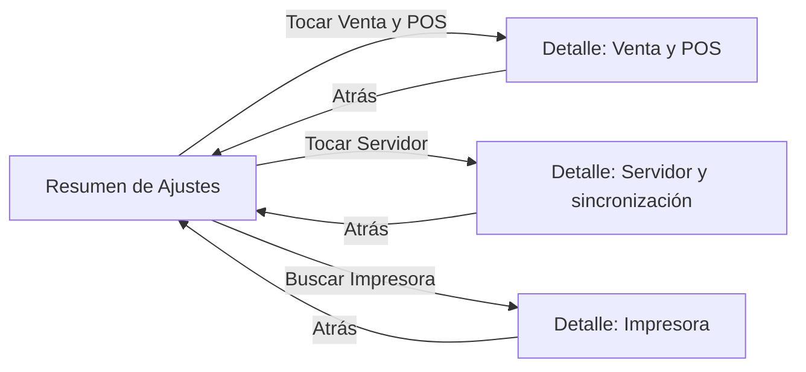

# Guía técnica para reorganizar la sección Ajustes

## 1. Objetivo

Reorganizar visual y navegacionalmente **Ajustes** para que se comporte como una sección administrativa moderna de Android:

- La pantalla principal muestra categorías y un resumen breve.
- Al tocar una categoría se abre una pantalla de detalle real, con título propio y botón Atrás.
- Los controles no aparecen debajo de la pantalla principal.
- Se conserva la lógica existente de guardado, sincronización, permisos, payloads y reglas de negocio.
- La mejora aplica a Ajustes, sin mezclar Venta, Ticket, Deporte, Pick ni las reglas de lotería.

Esta guía trata UX, arquitectura de UI y navegación. No autoriza cambios en servidor ni en contratos de API.

## 2. Diagnóstico del estado actual

La implementación principal está en:

`app/src/main/java/com/lotterynet/pro/ui/admin/AdminConfigActivity.kt`

Actualmente:

1. `AdminConfigActivity` mantiene `selectedConfigAreaId`.
2. `SystemConfigurationHub` muestra categorías como tarjetas.
3. Al pulsar una tarjeta solo cambia `selectedConfigAreaId`.
4. La misma `LazyColumn` vuelve a dibujar debajo el detalle de la categoría.
5. La búsqueda selecciona una categoría, pero tampoco abre una pantalla nueva.
6. El texto `Categoría abierta: ...` confirma que se usa expansión dentro de la página.
7. Existe `resolveSettingsDestinationGroups()` en `NativeChrome.kt`, pero no actúa como navegación visible para el usuario.

### Problema de experiencia

El comportamiento actual es un **hub con detalle inline**. Para una pantalla administrativa con muchos controles esto provoca:

- el usuario no percibe que entró a una sección;
- la pantalla se vuelve larga y difícil de escanear;
- la tarjeta parece no haber hecho nada porque el contenido aparece más abajo;
- se pierde el contexto del título de la sección;
- el botón Atrás no representa una jerarquía clara;
- en POS los controles compiten por espacio;
- buscar una opción y mostrarla debajo es menos predecible que abrir su destino.

### Conclusión

La mejora correcta es de navegación y organización visual: separar **Resumen de Ajustes** y **Detalle de Ajuste** como dos estados/pantallas claramente identificables.

## 3. Principios oficiales aplicables

Android recomienda que los ajustes sean organizados, predecibles y fáciles de administrar. Un resumen debe presentar grupos claros, mientras que las categorías extensas deben abrir subpantallas propias. Para muchas opciones, grupos y subscreens evitan una lista interminable.

Referencias oficiales:

- [Android Developers: Settings](https://developer.android.com/design/ui/mobile/guides/patterns/settings)
- [Android Developers: App anatomy](https://developer.android.com/design/ui/mobile/guides/layout-and-content/app-anatomy)
- [Android Developers: Adaptive layouts](https://developer.android.com/design/ui/mobile/guides/layout-and-content/adapt-layout)
- [Android Developers: Layout basics](https://developer.android.com/design/ui/mobile/guides/layout-and-content/layout-basics)
- [Android Developers: Common layouts](https://developer.android.com/design/ui/mobile/guides/layout-and-content/common-layouts)
- [Android Developers: Navigation](https://developer.android.com/guide/navigation)
- [Android Developers: Navigation with Compose](https://developer.android.com/develop/ui/compose/migrate/migration-scenarios/navigation)
- [Android Developers: Testing Navigation in Compose](https://developer.android.com/guide/navigation/testing/compose)
- [Android Developers: Material 3 in Compose](https://developer.android.com/develop/ui/compose/designsystems/material3)
- [Material 3: Canonical layout examples](https://m3.material.io/foundations/layout/canonical-examples/overview)

La guía oficial de Settings incluye ejemplos visuales de resumen, listas agrupadas y subpantallas. Debe usarse como referencia durante la implementación.

## 4. Arquitectura de información propuesta

```text
Ajustes
├── Operación
│   ├── Venta y POS
│   ├── Loterías y jugadas
│   └── Cajeros
├── Caja
│   ├── Impresora
│   └── Cuadre
└── Sistema
    ├── Servidor y sincronización
    └── Diagnóstico
```

| Destino | Contenido | No debe contener |
|---|---|---|
| Venta y POS | modo POS, apariencia de venta y preferencias visuales | reglas de límites o payloads nuevos |
| Loterías y jugadas | disponibilidad visual y preferencias existentes | lógica de premios o cálculo de ventas |
| Cajeros | accesos y preferencias administrativas existentes | administración fuera del permiso actual |
| Impresora | impresora seleccionada, prueba y estado | cambios al contrato del driver |
| Cuadre | resumen y acceso al cuadre existente | duplicar cálculos de Reporte |
| Servidor y sincronización | estado y acciones existentes | nuevos reintentos o polling |
| Diagnóstico | estado técnico y ayuda | acciones destructivas sin confirmación |

### Límites

“Límites” debe seguir siendo una sección funcional propia si ya tiene un flujo separado. Puede aparecer como acceso dentro de Operación, pero no deben duplicarse sus controles dentro de Venta y POS o Loterías y jugadas.

## 5. Comportamiento objetivo

### Pantalla de resumen

Debe contener:

- título “Ajustes”;
- búsqueda opcional;
- estado breve de sincronización;
- grupos Operación, Caja y Sistema;
- una fila por destino;
- título, texto de apoyo, icono y flecha;
- resumen corto, por ejemplo “POS activo” o “Última sincronización: hace 2 min”.

No debe contener:

- paneles largos de controles;
- `Categoría abierta`;
- switches de cada sección;
- formularios completos;
- la misma opción repetida en varias tarjetas.

### Pantalla de detalle

Al pulsar “Venta y POS”:

- aparece una barra superior con Atrás y “Venta y POS”;
- se muestran solo los controles de esa sección;
- los cambios llaman a los mismos callbacks existentes;
- el usuario regresa con Atrás, gesto de regreso o botón del sistema;
- el resumen se actualiza al volver, sin recargar toda la sesión.

### Flujo visual



## 6. Wireframes recomendados

### Teléfono o POS compacto

```text
┌─────────────────────────────┐
│ Ajustes                 ⋮    │
├─────────────────────────────┤
│ Buscar ajustes               │
├─────────────────────────────┤
│ OPERACIÓN                    │
│ ⚙ Venta y POS          ›    │
│   POS activo                 │
│ ◉ Loterías y jugadas    ›   │
│   Configuración disponible   │
│ 👤 Cajeros              ›    │
│   4 usuarios activos         │
├─────────────────────────────┤
│ CAJA                         │
│ ▣ Impresora             ›    │
│   Conectada                  │
│   Cuadre                ›    │
│   Resumen del día            │
├─────────────────────────────┤
│ SISTEMA                      │
│ ⇄ Servidor y sincronización› │
│   Sincronizado               │
│ ◌ Diagnóstico           ›    │
└─────────────────────────────┘
```

Al tocar una fila:

```text
┌─────────────────────────────┐
│ ‹  Venta y POS              │
├─────────────────────────────┤
│ Apariencia                  │
│ Modo POS                    │
│ Compacta la venta para      │
│ pantallas pequeñas      [●] │
├─────────────────────────────┤
│ Preferencias de venta       │
│ ...                         │
└─────────────────────────────┘
```

La guía oficial de Android Settings y los ejemplos canónicos de Material 3 son la referencia visual; estos wireframes adaptan esa jerarquía al dominio de la app.

### Tablet o pantalla ancha

```text
┌──────────────────┬────────────────────────────────┐
│ Ajustes          │ Venta y POS                    │
│                  │                                │
│ Operación        │ Apariencia                     │
│  Venta y POS  ›  │ Modo POS                 [●]  │
│  Loterías     ›  │ Compactar venta                │
│  Cajeros      ›  │                                │
│                  │ Preferencias                   │
│ Caja             │ ...                            │
│  Impresora    ›  │                                │
│  Cuadre       ›  │                                │
└──────────────────┴────────────────────────────────┘
```

En pantalla ancha puede evolucionarse a un patrón list-detail. En POS compacto se mantiene una sola pantalla por vez.

## 7. Mapeo a Jetpack Compose Material 3

| Necesidad | Componente recomendado |
|---|---|
| Contenedor | `Scaffold` |
| Título y regreso | `TopAppBar` o `CenterAlignedTopAppBar` |
| Lista | `LazyColumn` |
| Fila de ajuste | `ListItem` dentro de `Surface` o `Card` |
| Separación | texto de sección + `HorizontalDivider` |
| Booleano | `Switch` |
| Una opción | `RadioButton` o `SingleChoiceSegmentedButtonRow` |
| Estado | `AssistChip` o texto de apoyo |
| Búsqueda | `SearchBar` o `OutlinedTextField` |
| Confirmación | `AlertDialog` |
| Guardado | `SnackbarHost` |
| Carga | `CircularProgressIndicator` |

### Reglas de estilo

- Usar `MaterialTheme.colorScheme`, `typography` y `shapes`; no colores aislados para cada botón.
- Reservar el color de error para errores y acciones destructivas.
- Usar color primario para la acción principal y estados activos.
- Usar superficies tonales para agrupar, no gradientes fuertes en cada fila.
- Mantener icono, título, apoyo y estado alineados.
- No usar una tarjeta grande como botón si una fila comunica mejor.
- Una flecha indica navegación; un switch indica cambio inmediato. No mezclarlos en la misma acción.
- Mantener un objetivo táctil mínimo de aproximadamente 48 dp.
- Los iconos decorativos usan descripción nula; los accionables tienen descripción.

### Patrón conceptual de una fila

```kotlin
ListItem(
    headlineContent = { Text(destination.title) },
    supportingContent = { Text(destination.summary) },
    leadingContent = { Icon(destination.icon, contentDescription = null) },
    trailingContent = {
        Icon(
            Icons.AutoMirrored.Filled.ChevronRight,
            contentDescription = "Abrir"
        )
    },
    modifier = Modifier.clickable { onOpen(destination.id) }
)
```

Es un patrón visual. Debe conservarse el modelo de datos y los callbacks actuales; no se debe mover lógica de ventas, límites, sincronización ni payloads a la UI.

## 8. Navegación sin romper el flujo existente

Como el proyecto usa Activities y pantallas existentes, no conviene convertir toda la aplicación a Navigation Compose en una sola fase.

1. Mantener `AdminConfigActivity` como entrada.
2. Separar el resumen y los detalles en destinos de UI.
3. Para detalles Compose, usar navegación interna o estado de pantalla controlado.
4. Para destinos con Activity propia, conservar callbacks actuales.
5. Pasar solo un identificador como `AdminConfigArea`, no objetos completos.
6. Leer el estado desde la fuente existente.
7. No crear una segunda fuente de verdad para límites, cajeros o servidor.

Destinos conceptuales:

```text
settings/overview
settings/venta-pos
settings/loterias
settings/cajeros
settings/impresora
settings/cuadre
settings/servidor
settings/diagnostico
```

Los nombres son rutas de UI; no deben convertirse automáticamente en endpoints ni cambiar payloads.

### Regla de regreso

- Abrir una categoría agrega un nivel.
- Atrás vuelve al resumen.
- Se conservan búsqueda y posición cuando sea posible.
- Si hay cambios sin guardar, se usa el mecanismo existente; no se inventa otro guardado.

## 9. Búsqueda de ajustes

La búsqueda debe buscar destinos, no alterar controles:

- “impresora” → muestra Impresora → abre su detalle.
- “pos” → muestra Venta y POS → abre su detalle.
- “sincronización” → muestra Servidor y sincronización.

No debe cambiar switches, ejecutar red, crear categorías temporales ni duplicar opciones.

## 10. Estados y feedback

| Estado | Presentación |
|---|---|
| Cargando | placeholder o indicador dentro del detalle |
| Disponible | controles y estado actual |
| Guardado local | Snackbar “Guardado en este dispositivo” |
| Sincronizando | indicador pequeño junto al estado |
| Sincronizado | texto breve con hora |
| Pendiente | estado pendiente y acción existente |
| Error | mensaje accionable y reintento existente |
| Sin permiso | control deshabilitado con explicación |

Esto es presentación. No se deben agregar polling, reintentos ni llamadas nuevas para actualizar etiquetas.

## 11. Roles y seguridad visual

- Master ve los destinos que ya puede administrar.
- Admin ve los destinos permitidos por su configuración.
- Supervisor y cajero no reciben controles nuevos por reorganizar la pantalla.
- Un destino sin permiso no debe aparecer como fila vacía.
- Un control deshabilitado explica por qué sin exponer datos de otro perfil.

La UI no sustituye la autorización del servidor.

## 12. Diseño para POS compacto

El modo POS debe reutilizar la jerarquía con densidad adecuada:

- una columna;
- títulos cortos;
- barra superior compacta;
- menos espacio entre filas, sin perder legibilidad;
- navegación de detalle a pantalla completa;
- no abrir formularios largos debajo del resumen;
- no competir con dos acciones primarias en la misma fila.

La compactación cambia presentación, no impresión, venta ni sincronización.

## 13. Accesibilidad y calidad visual

Comprobar:

- TalkBack anuncia título, descripción, estado y acción.
- La fila completa es tocable, no solo la flecha.
- Contraste correcto en claro y oscuro.
- El estado no depende únicamente del color.
- Funciona con aumento de fuente.
- Los textos no se cortan en español.
- Atrás funciona con botón y gesto.
- El teclado no tapa búsqueda ni controles.
- Funciona en vertical y horizontal.

## 14. Plan de implementación por fases

### Fase 0 — Congelar contrato

- No tocar payloads, repositorios ni servicios.
- No cambiar límites, ventas, sincronización, impresión o autenticación.
- Identificar callbacks que cada detalle debe seguir llamando.

### Fase 1 — Modelo de destinos

- Definir una lista única de destinos.
- Reutilizar títulos, iconos, resúmenes y permisos.
- No duplicar el agrupamiento de `NativeChrome`.

### Fase 2 — Resumen

- Convertir tarjetas en grupos de filas Material 3.
- Eliminar el detalle inline.
- Mantener búsqueda y estados resumidos.

### Fase 3 — Detalles

- Cada categoría abre detalle con TopAppBar y Atrás.
- Mover solo presentación de controles.
- Mantener callbacks, validaciones y persistencia.

### Fase 4 — Navegación y búsqueda

- Cada fila abre su destino correcto.
- La búsqueda filtra destinos y abre el elegido.
- Atrás conserva contexto.

### Fase 5 — Responsive y POS

- Una columna compacta para POS/teléfono.
- List-detail para pantallas anchas cuando aporte valor.
- Mantener objetivos táctiles y etiquetas.

### Fase 6 — Accesibilidad y estados

- Revisar TalkBack, tema oscuro, fuente grande, carga y error.
- Añadir feedback sin llamadas adicionales.

### Fase 7 — Validación

- Revisar diff y referencias.
- Ejecutar pruebas UI/Compose solo cuando se solicite.
- Smoke test con Master, Admin, Supervisor y Cajero.
- Confirmar que no hubo cambios de servidor.

## 15. Matriz de pruebas de aceptación

### Navegación

- Cada fila abre exactamente su detalle.
- Venta y POS no abre Loterías y jugadas.
- Impresora no abre Cuadre.
- Servidor no abre Diagnóstico.
- Atrás devuelve al resumen.
- La búsqueda abre el destino correcto.

### Persistencia visual

- Un switch conserva su valor al salir y volver.
- El resumen muestra el estado actualizado.
- No se resetea fondo, límites ni configuración de cajero.
- Un toque no ejecuta callbacks dos veces.

### Integridad

- No se modifican ventas, tickets ni payloads.
- No se agregan llamadas a API Gateway, Auth, Postgres o Realtime.
- No se agrega polling.
- POS solo cambia densidad y presentación.

### Roles

- Master, Admin, Supervisor y Cajero ven únicamente lo permitido.

## 16. Criterios de aceptación visual

La implementación será correcta cuando:

1. Ajustes abre un resumen limpio, no un formulario largo.
2. Tocar una categoría cambia claramente el título.
3. Existe Atrás.
4. No aparecen detalles debajo del resumen.
5. Los grupos tienen jerarquía.
6. Los estados se entienden por texto e icono, no solo color.
7. Funciona en POS y teléfono.
8. No cambia la lógica existente.
9. No hay destinos duplicados.
10. Las pruebas confirman cada destino.

## 17. Lo que no se debe hacer

- No convertir todo en botones coloreados sin jerarquía.
- No usar una tarjeta gigante para todos los controles.
- No usar un ModalBottomSheet para una sección extensa.
- No mantener el detalle debajo del resumen.
- No duplicar controles entre Ajustes, Límites y otras secciones.
- No mezclar navegación visual con red.
- No cambiar la fuente de verdad.
- No activar polling.
- No cambiar loterías normales, Pick, Deporte o Ticket en este rediseño.

## 18. Resultado esperado

La experiencia final debe ser:

```text
Resumen claro → categoría visible → detalle propio → Atrás al resumen
```

Es una mejora significativa de UX y segura para producción porque deja intactos los flujos y contratos existentes.

## 19. Estado de esta guía

- Análisis estático del código: completado.
- Documentación oficial Android/Compose/Material 3: revisada.
- Wireframes y arquitectura: completados.
- Cambios de código: implementados en `AdminConfigActivity`.
- Portada: categorías separadas por Operación, Caja y Sistema.
- Navegación: Atrás visible y botón/gesto del sistema regresan primero al resumen.
- Bloqueos: duración seleccionable, consecuencias explícitas y acciones apiladas para pantallas compactas.
- Integridad: se conservaron callbacks, repositorios, payloads y sincronización existentes.
- Build Gradle: no ejecutado.
- Contrato Node de Ajustes: aprobado.
- Captura visual desde emulador: pendiente; no había dispositivo ADB conectado durante esta revisión.
